# Reconstruction de champs aérodynamiques compressibles par attention géométrique

Apprentissage d'un opérateur qui reconstruit un champ Euler 2D haute résolution à partir
d'une information moins chère : soit une simulation grossière, soit des observations de
paroi seules. Tout se fait sur maillages non structurés, sans grille fixe.

Formellement, on apprend

    F(u_LR, M, alpha, G) -> u_HR

où u_LR et u_HR vivent sur deux maillages différents et où la géométrie G peut changer.

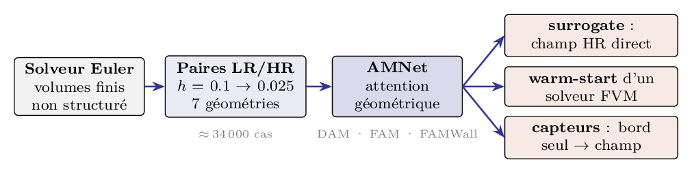

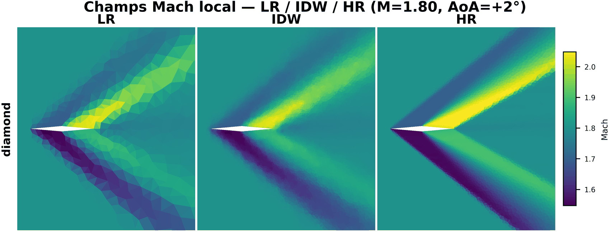

Le dépôt contient les deux moitiés du travail : le solveur volumes finis qui produit les
données, et les modèles qui apprennent dessus.

## Structure

| Dossier | Contenu |
|---|---|
| euler/ | solveur Euler 2D volumes finis (JAX), génération de maillages, post-traitement |
| preprocessing/ | conversion des bundles FVM bruts en jeux d'entraînement, tables kNN, statistiques |
| models/ | DAM, FAM, SIAM, FAMWall/DAMWall et le backbone AMNet partagé |
| eval/ | évaluation : sweeps, cas unique, FVM en direct, convergence en warm start |
| utils/ | métriques, aéro (Cp, CL, CD), géométrie, visualisation |
| configs/ | configurations d'entraînement (YAML) |
| slurm/ | scripts de soumission pour les campagnes |

## Partie Euler

Solveur volumes finis explicite pour Euler compressible 2D sur maillages triangulaires non
structurés, écrit en JAX (le pas de temps complet est compilé en un seul scan). Flux HLLC,
reconstruction MUSCL, intégration SRK2 par défaut, arrêt sur résidu de stationnarité.

Les maillages sont générés avec meshpy, avec raffinement piloté par la courbure de paroi et
la distance à l'obstacle.

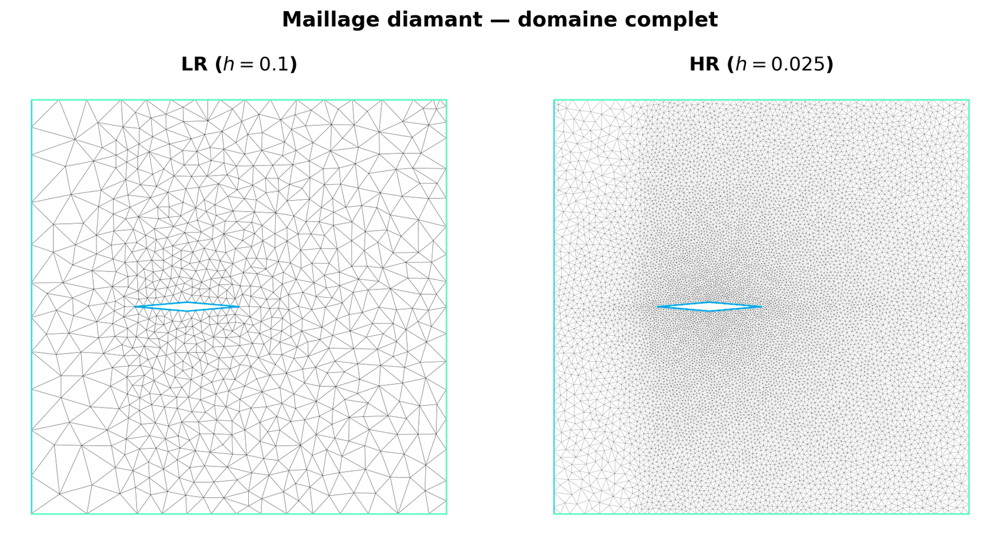

### Vérification et validation

Le champ HR est la vérité terrain de tout l'apprentissage : sa crédibilité doit être établie
avant d'apprendre dessus. Sur le losange, l'écoulement admet une solution analytique, chocs
obliques et détentes de Prandtl-Meyer en cascade, ce qui permet de mesurer l'erreur du solveur
sans référence numérique.

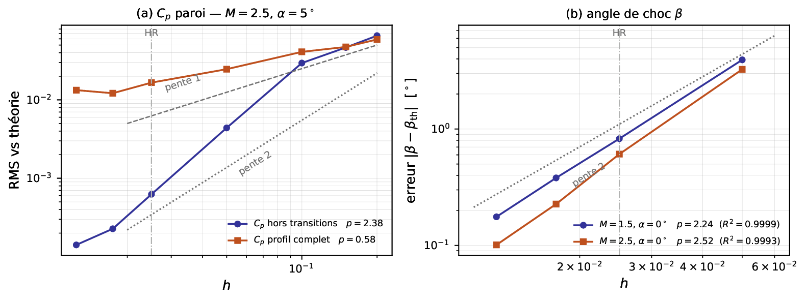

L'ordre observé colle au schéma : p = 2.24 sur l'angle de choc (R2 = 0.9999), p = 2.38 sur le
Cp hors transitions. Le profil complet tombe à p = 0.58, le choc capté limitant l'ordre
ponctuel quel que soit le schéma. À la résolution cible h = 0.025, CD est à 1.8 % de la théorie
et l'angle de choc à 0.83 degré.

Les deux campagnes correspondantes vivent dans euler/postproc/ : convergence de maillage avec
indice GCI de Roache, et confrontation à la théorie choc-détente.

### Choix des résolutions

Le couple LR/HR n'est pas arbitraire, il sort de l'étude de convergence sous contrainte de ce
qu'on peut réellement calculer et stocker.

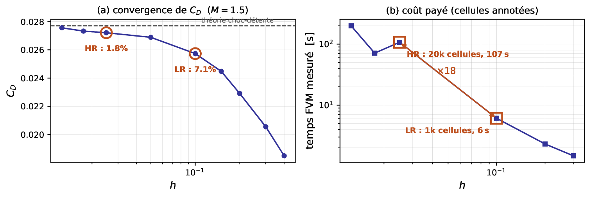
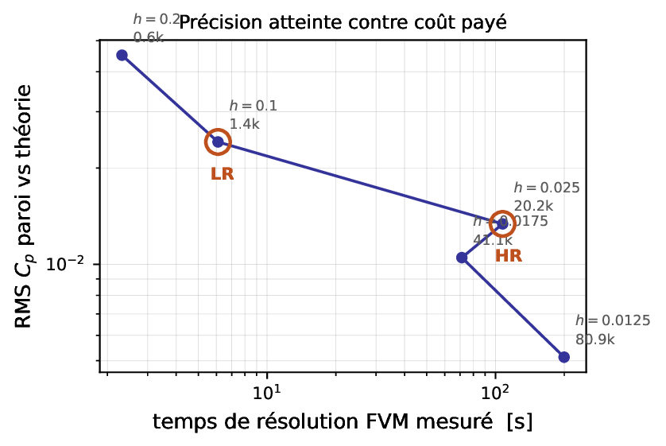

HR h = 0.025 (20.2k cellules, 107 s par cas) est le premier maillage à moins de 2 % de la
théorie sur CD ; le suivant coûte deux fois plus cher pour ramener l'écart à 0.5 %. LR h = 0.1
(1.4k cellules, 6 s) est délibérément mauvais, 7 % d'erreur, mais pas informe : il contient
encore la structure de choc, seulement étalée. C'est ce qu'il faut à un modèle résiduel, qui
corrige plutôt qu'il n'invente.

### Jeu de données

Grille commune à toutes les géométries : 231 valeurs de Mach dans [0.7, 3.0] et 21 incidences
dans [-5, 5] degrés au pas de 0.5, soit 4 851 cas HR par profil, chacun simulé aussi en LR
h = 0.1 et h = 0.2.

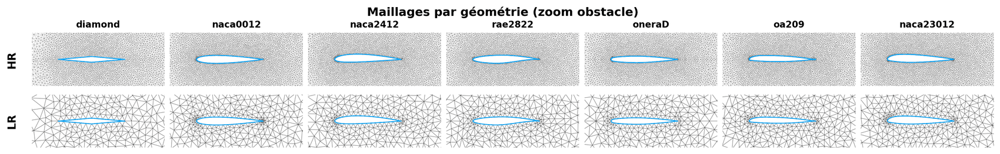

| Géométrie | Caractère | Rôle |
|---|---|---|
| diamond | arêtes vives | entraînement |
| naca0012 | symétrique | entraînement |
| naca2412 | cambré | entraînement |
| rae2822 | supercritique | entraînement |
| oneraD | ONERA M6 | entraînement |
| oa209 | pale d'hélicoptère | test d'extrapolation |
| naca23012 | série 5 chiffres | test d'extrapolation |

Au total 91 530 résolutions FVM, environ 2000 heures de GPU cumulées. Le split 80/10/10 est
déterministe et stratifié en (M, alpha) : le test mesure donc l'interpolation, l'extrapolation
géométrique étant évaluée séparément.

Ce qui est stocké, par cellule et non sur une grille : pour le HR le barycentre, les quatre
primitives (rho, u, v, p) et le gradient de pression, qui sert à la fois de cible et de
pondération de la loss ; pour le LR le barycentre, les primitives, le gradient de pression et
la divergence de la vitesse ; par niveau, la distance à la paroi, son atténuation et la
normale ; et globalement M, alpha, log(h_LR / 0.1) et la géométrie.

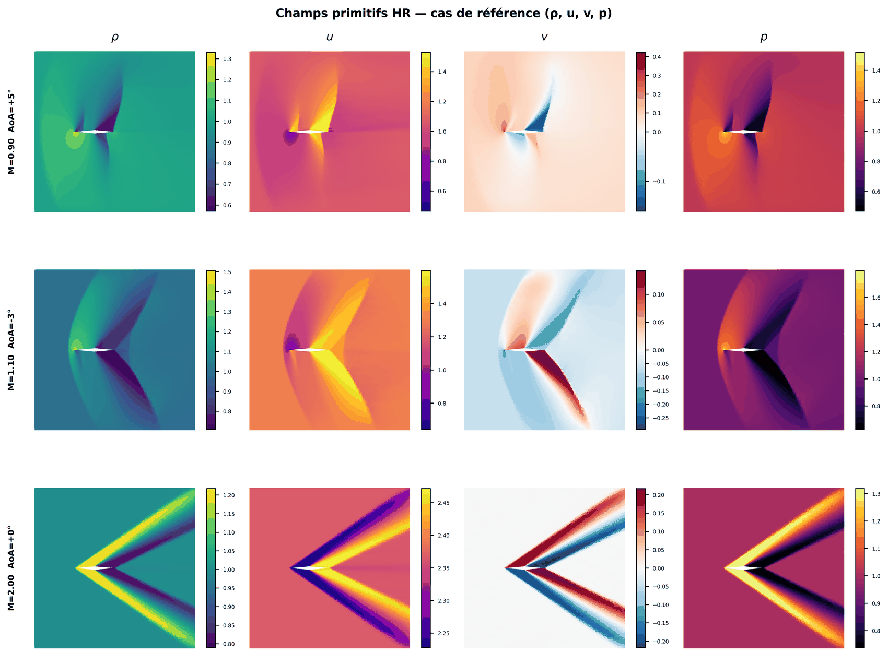

Les trois régimes de la grille se lisent directement : transsonique avec choc pariétal à
M = 0.90, choc détaché naissant à M = 1.10, et système de chocs obliques attachés à M = 2.00.

Générer un maillage, lancer un cas, puis produire une grille complète :

```bash
uv run python euler/generate_mesh.py --geom naca2412 -h 0.1 0.025
uv run python euler/main.py --case diamond --Mach 2.5 --aoa 5 --flux HLLC --reconstruction MUSCL
uv run python slurm/run_euler_grid.py --case diamond \
    --mesh-path data/meshes/diamond_h0.025.npy --mach 0.7:3.0:0.01 --aoa -5:5:0.5
```

## La baseline : interpolation IDW

L'interpolation par distance inverse (k = 6, p = 2) sert deux fois : comme référence
d'évaluation, et comme point de départ des modèles, qui sont tous résiduels. Elle est
sans apprentissage, indépendante du maillage, en O(Nk).

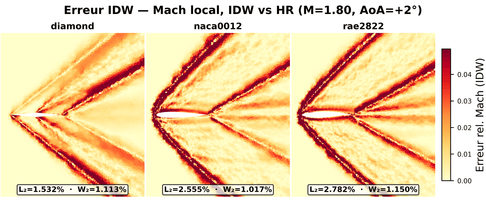

Elle replace les chocs mais en lisse la marche, et ne conserve rien. Surtout, son erreur vit
sur les chocs, donc sur un ensemble de mesure faible. D'où, dans toute la suite, une loss
pondérée par la norme du gradient de pression et des métriques dédiées, une L2 globale étant
trompeuse.

## Partie apprentissage

Le backbone commun est AMNet, un U-Net attentionnel sur une hiérarchie de maillages
(h = 0.025 / 0.05 / 0.1) : self-attention locale kNN à pleine résolution, cross-attention
locale pour descendre d'un niveau, self-attention globale au bottleneck, cross-attention
résiduelle pour remonter, décodeur linéaire initialisé à zéro. Le conditionnement (Mach,
incidence, résolution LR, géométrie, et le temps t pour les modèles génératifs) passe par
FiLM/AdaLN dans chaque bloc. Environ 1.67 M de paramètres en mono-géométrie, 2.94 M en
multi-géométrie.

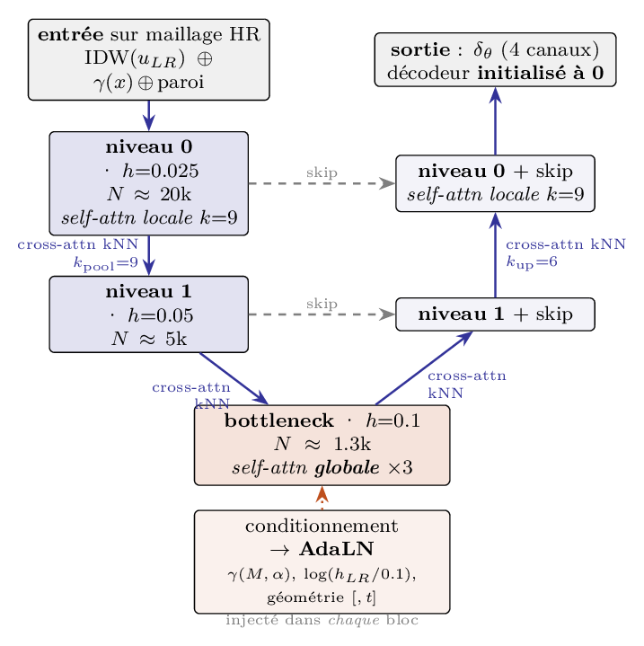

Quatre modèles partagent ce backbone :

| Modèle | Principe | Entrée |
|---|---|---|
| DAM | régression déterministe du résidu sur la baseline IDW | champ LR volumique |
| FAM | flow matching, transporte du bruit vers le résidu, ODE de Heun | champ LR volumique |
| SIAM | interpolant stochastique, pont direct LR vers HR (Albergo et al.) | champ LR volumique |
| FAMWall / DAMWall | reconstruction depuis le bord seul, encodeur de paroi et cross-attention dense | N valeurs de paroi |

Le chemin d'inférence de FAM, du bruit au champ reconstruit :

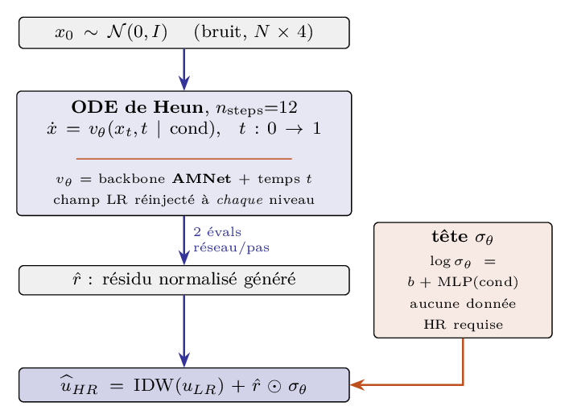

L'échelle du résidu peut être calibrée sur la vérité terrain HR, ce qui est indisponible en
déploiement réel, ou prédite par une petite tête à partir du seul conditionnement
(learned_res_scale). C'est cette seconde option qui rend le modèle utilisable sur une
géométrie ou une résolution inconnue.

L'entraînement se fait en 200 époques, AdamW à 5e-4, decay cosinus avec 20 époques de warmup,
grad-clip 2.0, moyenne mobile EMA des poids à 0.999, batch de 12 champs, calcul en bfloat16.
La loss est une MSE relative pondérée par la norme du gradient de pression, plus une pénalité
de conservation d'enthalpie. En multi-géométrie, une branche est un couple (géométrie,
résolution LR).

### Le cas bord seul

FAMWall et DAMWall changent de paradigme : plus de champ LR volumique, on n'observe que N
points sur la paroi, comme des capteurs de pression sur une aile. Le backbone AMNet est
réutilisé sans modification ; un bloc de cross-attention dense vers les tokens de bord est
ajouté à chaque niveau, et la baseline devient une IDW du bord fondue vers le freestream.

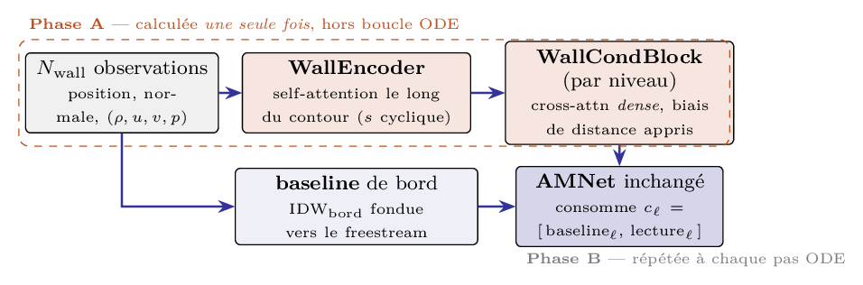

L'encodage du bord se calcule une seule fois, hors de la boucle ODE, et seul l'AMNet est
répété à chaque pas d'intégration.

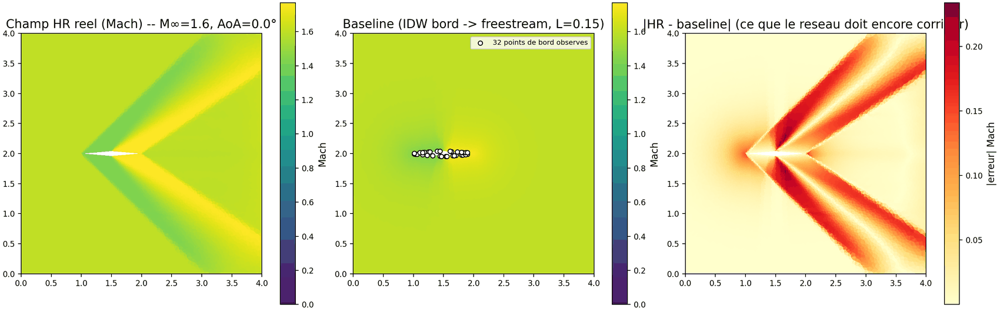

Les capteurs sont placés par quantiles de courbure, donc la densité se concentre fortement
quand N diminue.

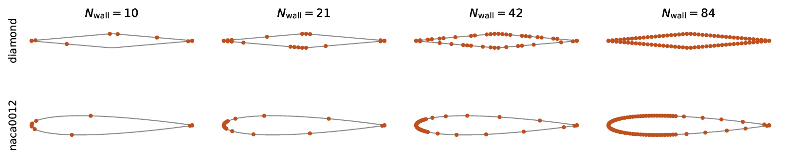

### Utilisation

Prétraitement (une fois par géométrie et par résolution) :

```bash
uv run python preprocessing/preprocess.py --data data/ --geometry diamond --hr_res 0.025 --lr_res 0.1
uv run python preprocessing/preprocess_wall.py --data data/ --geometry diamond --n_wall 84
```

Entraînement, piloté par un YAML de configs/ :

```bash
uv run python train.py --config configs/dam_sd.yaml --run_name dam_sd
uv run python train_wall.py --config configs/fam_wall_sd.yaml --run_name FAMWALL_N84
```

Les configurations suivent un schéma systématique : sd pour mono-géométrie, md pour
multi-résolution, 2geo / 5geo / 6geo pour le nombre de géométries d'entraînement.

Évaluation sur un ou plusieurs jeux de test, avec figures et tableaux de synthèse :

```bash
uv run python evaluate.py --data data/ --models results/checkpoints/dam_sd/DAM.pkl \
    --testsets diamond naca0012 --full_eval --out_dir results/eval/
```

Évaluation sur un cas unique, avec temps de résolution FVM mesurés en direct pour une
comparaison de coût honnête :

```bash
uv run python eval_case.py --data data/ --geometry diamond --mach 1.5 --aoa 3 \
    --models results/checkpoints/dam_sd/DAM.pkl
```

Campagne de warm start : on repart de la prédiction comme champ initial du solveur et on
compte les itérations jusqu'à re-stationnarisation.

```bash
uv run python eval_convergence_sweep.py --data data/ --geometry diamond \
    --models results/checkpoints/dam_sd/DAM.pkl --stride_mach 4 --stride_aoa 4
```

Chaque script a son équivalent sbatch dans slurm/.

## Résultats principaux

### Super-résolution en distribution

Modèles entraînés sur diamond seul, LR h = 0.1, testés sur 504 cas (M, alpha) non vus.

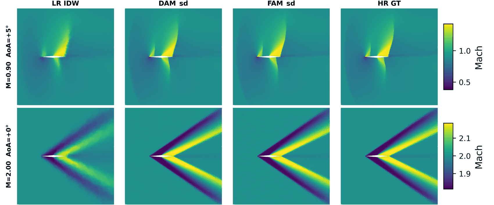

| Modèle | W2 | L2(Cp) | dCL | dCD | temps/cas |
|---|---|---|---|---|---|
| LR IDW (baseline) | 2.26e-2 | 3.42e-1 | 4.48e-2 | 3.35e-3 | 4.6 ms |
| DAM | 8.42e-4 | 8.82e-3 | 6.40e-4 | 4.81e-5 | 6.3 ms |
| FAM | 1.12e-3 | 1.08e-2 | 7.68e-4 | 6.96e-5 | 554.8 ms |

La marche de choc lissée par l'IDW est restaurée, en transsonique comme en supersonique. Face
à la baseline : facteur 27 sur W2, 39 sur L2(Cp), 70 sur dCL, 68 sur dCD. DAM domine partout
pour 88 fois moins cher que FAM, dont le coût vient du protocole génératif (16 pas de Heun à
2 évaluations, 4 échantillons moyennés, soit 128 passes réseau). Les 6.3 ms de DAM se comparent
aux 107 s du solveur HR, soit un facteur 17 000.

La solution des équations d'Euler étant déterministe, il n'y a pas de distribution à
apprendre : le génératif ne paie pas ici, il ne garde un léger avantage qu'en extrapolation.

### Invariance par translation

Jeu de test dédié : même profil, même régime, obstacle déplacé en x et en y, prétraité à part,
sans aucun réentraînement. Un réseau qui aurait mémorisé des positions absolues s'effondrerait.

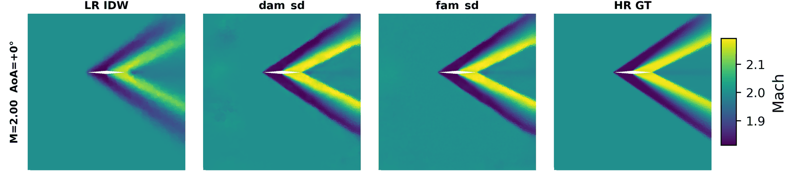

La structure de choc reste bien placée et nette, mérite du repère centré sur l'obstacle et des
positions relatives. L'erreur reste 6.6 fois sous la baseline, contre 27 sans translation :
robuste, mais pas gratuitement.

### Généralisation à une géométrie inconnue

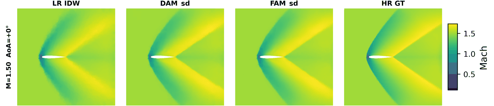

Le spécialiste diamond ne transfère pas : dCL et L2(Cp) sont pires que l'IDW. Un spécialiste
NACA0012 atteint, lui, un facteur 14 sur W2.

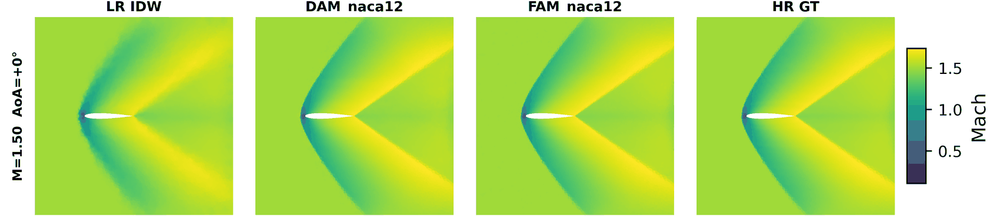

W2 par géométrie, selon le nombre de géométries vues à l'entraînement :

| Modèle | diamond | naca0012 | rae2822 | oa209 | naca23012 |
|---|---|---|---|---|---|
| LR IDW | 2.26e-2 | 2.92e-2 | 3.03e-2 | 2.32e-2 | 2.14e-2 |
| DAM_2geo | 8.86e-4 (vue) | 1.87e-3 (vue) | 1.12e-2 | 1.20e-2 | 1.54e-2 |
| DAM_5geo | 1.09e-3 (vue) | 2.11e-3 (vue) | 2.01e-3 (vue) | 9.56e-3 | 1.22e-2 |
| FAM_5geo | 1.46e-3 (vue) | 2.78e-3 (vue) | 2.50e-3 (vue) | 8.23e-3 | 8.45e-3 |

La mention (vue) signale une géométrie présente à l'entraînement du modèle ; oa209 et
naca23012 ne le sont par aucun modèle. Trois observations : ajouter des géométries dégrade
légèrement en distribution (la capacité est partagée), l'ordre s'inverse en extrapolation, et
le plafond reste bas puisque le meilleur généraliste ne descend qu'à un facteur 2.5 sous la
baseline sur une géométrie inconnue, contre 27 en distribution. DAM apprend mieux en
distribution, FAM extrapole mieux.

Le modèle 5geo en images, même modèle et même régime (M = 0.80, alpha = +3 degrés), sur deux
géométries vues puis deux jamais vues :

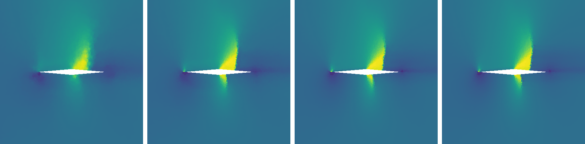
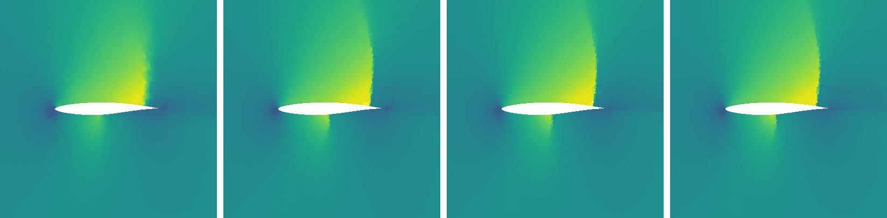
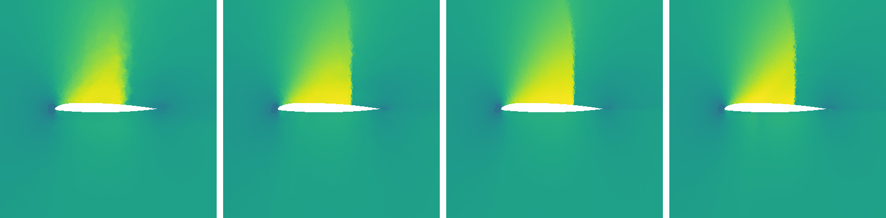
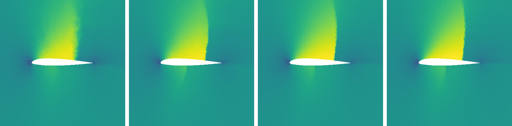

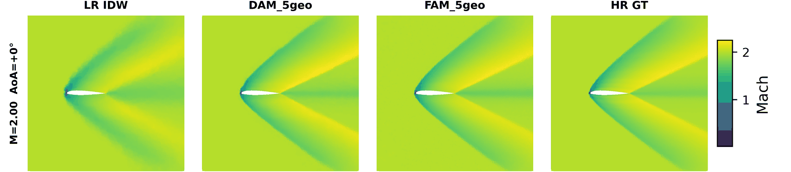

### Jusqu'où dégrader l'entrée

Mêmes modèles entraînés avec une entrée deux fois plus grossière, LR h = 0.2, soit environ 600
cellules pour en reconstruire 20 000, un facteur 34.

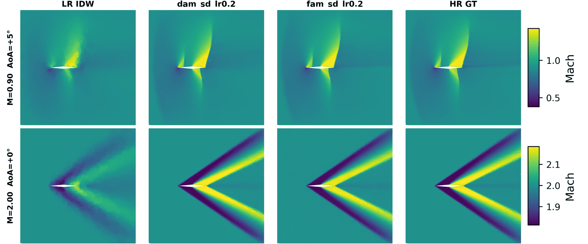

Sur sa propre résolution, le modèle garde un facteur 20 sur W2 et 22 sur L2(Cp) alors que le
champ d'entrée est presque méconnaissable : la méthode ne demande donc pas une entrée déjà
bonne. Mais servie avec une entrée plus fine que celle vue à l'entraînement, elle retombe à un
facteur 2.6. L'extrapolation en résolution est réelle mais coûteuse, le conditionnement par
log(h_LR) ne suffit pas à l'absorber.

### Warm start de solveur

Au lieu de remplacer le solveur, on l'initialise avec la prédiction. Médianes sur les 504 cas
de test, deux critères d'arrêt suivis en parallèle : le résidu, qui garantit que l'équation est
réellement résolue, et un critère ingénieur, CD et CL à 0.1 % de la valeur HR.

| Champ initial | itérations | gain itér. | gain temps | gain ingénieur |
|---|---|---|---|---|
| cold start (freestream) | 6 122 | 1.0 | 1.0 | 1 |
| LR IDW (sans réseau) | 2 778 | 2.1 | 2.0 | 2 |
| DAM | 775 | 8.9 | 8.0 | 17 |
| FAM | 770 | 8.8 | 8.1 | 11 |

C'est l'usage le plus solide de la méthode : aucune approximation ne subsiste dans le résultat
final, le solveur garantit la physique et le réseau ne fait que gagner du temps. Le gain
atteint encore un facteur 5.6 sur la pipeline complète (résolution LR, inférence, warm start).

### Reconstruction depuis la paroi seule

FAMWall et DAMWall reconstruisent le champ complet à partir de 84 valeurs de paroi, sans aucun
champ LR volumique.

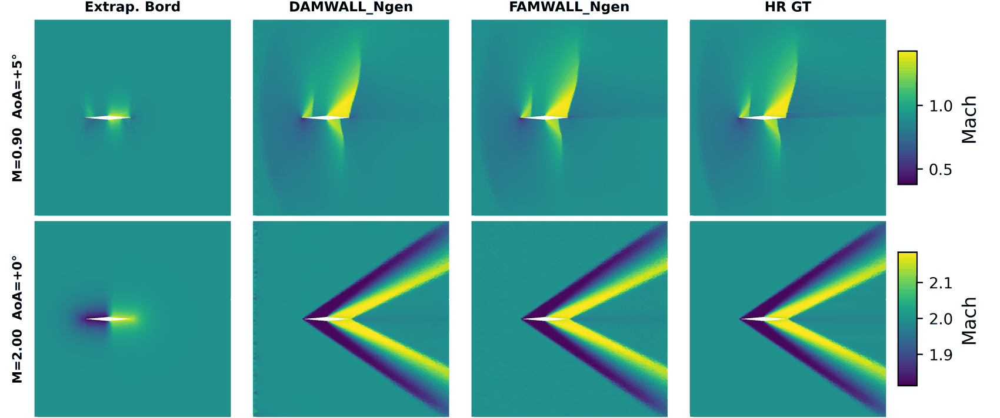

| Modèle | W2 | L2(Cp) | dCL | dCD |
|---|---|---|---|---|
| Extrapolation de bord (baseline) | 6.39e-2 | 1.26e-1 | 2.77e-2 | 9.01e-4 |
| DAMWall | 2.03e-3 | 2.03e-2 | 1.32e-3 | 1.09e-4 |
| FAMWall | 2.28e-3 | 1.76e-2 | 1.73e-3 | 1.12e-4 |

Facteur 31 sous la baseline sur W2 et 6 sur L2(Cp), à un facteur 2.4 seulement du modèle
volumique DAM, avec 84 valeurs de paroi contre 1 400 cellules. Les chocs, qui ne sont pas
observés, sont replacés correctement à partir de la seule signature pariétale. L'application
visée est la reconstruction depuis des capteurs de pression, cadre plus réaliste que de
disposer d'un calcul LR complet.

Sur le nombre de capteurs, W2 en fonction de N :

| N | spécialiste | FAMWall N variable | DAMWall N variable |
|---|---|---|---|
| 84 | 2.26e-3 | 2.27e-3 | 2.03e-3 |
| 42 | 2.32e-3 | 2.32e-3 | 2.02e-3 |
| 21 | 2.39e-3 | 2.66e-3 | 2.21e-3 |
| 10 | 2.42e-3 | 3.23e-3 | 2.45e-3 |

Tirer N au hasard à chaque époque (wall_k_range dans la config) donne un modèle unique qui
égale les spécialistes jusqu'à N = 42. En warm start, l'accélération reste stable entre 6 et 7
en itérations quel que soit le nombre de capteurs ; en revanche ces champs sont erratiques sur
le critère ingénieur, avec 42 % des cas seulement atteignant la tolérance sur CD et CL. Bons
pour amorcer un solveur, pas pour livrer directement des coefficients.

## Limites connues

L'extrapolation géométrique reste le point faible : très bon interpolateur, extrapolateur
médiocre, et ajouter des géométries n'aide que marginalement. Le problème est le
conditionnement, pas le volume de données. L'extrapolation en résolution existe mais coûte
cher, le conditionnement par log(h_LR) ne suffisant pas à l'absorber. Le génératif, enfin, ne
paie pas sur Euler : la solution est déterministe, il n'y a pas de distribution à apprendre.
Il retrouverait son sens sur une cible intrinsèquement stochastique, typiquement Navier-Stokes
compressible ou la super-résolution de turbulence.

## Installation

```bash
uv sync
```

Python 3.11, JAX avec CUDA 12 sous Linux.

Les données ne sont pas versionnées. Le dépôt attend l'arborescence suivante sous data/ :
maillages dans meshes/, bundles FVM bruts dans raw/, jeux prétraités dans processed/, tables
kNN dans knn/, statistiques de normalisation dans stats/.
